# Gestor de Cursos React

**Autora:** Patricia Catalina Riveros Estay  
**Repositorio:** [Eva03-gestor-cursos-react](https://github.com/Anyaspycat/Eva03-gestor-cursos-react)  
**Aplicación publicada:** [Ver aplicación en Vercel](https://eva03-gestor-cursos-react.vercel.app/)

Aplicación web SPA desarrollada en React que permite consultar cursos desde una API externa, buscar cursos, filtrar por docente y administrar cursos favoritos.

## Funcionalidades

- Consumo de una API externa con Axios.
- Versión alternativa del servicio utilizando Fetch.
- Manejo de datos en formato JSON.
- Carga asíncrona utilizando `async/await`.
- Búsqueda de cursos por título.
- Filtro de cursos por docente.
- Cursos favoritos almacenados en `localStorage`.
- Contador general de favoritos.
- Contador de favoritos por docente.
- Modo oscuro almacenado en `localStorage`.
- Manejo de estados de carga y error.
- Validación y sanitización básica de textos.
- Análisis de calidad y seguridad mediante SonarQube.

## Tecnologías utilizadas

- React
- Vite
- JavaScript
- Axios
- Fetch API
- CSS
- LocalStorage
- ESLint
- SonarQube
- Docker
- Git y GitHub

## API utilizada

La aplicación consume la API pública:

`https://jsonplaceholder.typicode.com/posts`

La API entrega publicaciones con la siguiente estructura:

```json
{
  "userId": 1,
  "id": 1,
  "title": "Título",
  "body": "Descripción"
}
```

Los datos se transforman internamente en cursos:

```json
{
  "id": 1,
  "title": "Título del curso",
  "description": "Descripción del curso",
  "teacherId": 1
}
```

## Estructura del proyecto

```text
src/
├── components/
│   ├── CourseCard.jsx
│   ├── CourseList.jsx
│   ├── FavoriteStats.jsx
│   ├── Header.jsx
│   ├── SearchBar.jsx
│   ├── TeacherFilter.jsx
│   └── ThemeToggle.jsx
├── hooks/
│   └── useLocalStorage.js
├── services/
│   └── courseService.js
├── utils/
│   └── sanitize.js
├── App.jsx
├── App.css
└── main.jsx
```

## Componentes creados

### Header

Muestra el título y la descripción principal de la aplicación.

### SearchBar

Permite buscar cursos por título. El campo está limitado a 50 caracteres.

### TeacherFilter

Permite filtrar los cursos según el identificador del docente.

### CourseList

Recibe el listado de cursos y genera una tarjeta reutilizable para cada elemento.

### CourseCard

Muestra el título, descripción, docente y botón para agregar o quitar un curso de favoritos.

### FavoriteStats

Cuenta y muestra la cantidad de cursos favoritos correspondiente a cada docente.

### ThemeToggle

Permite alternar entre modo claro y modo oscuro.

## Hook personalizado

### useLocalStorage

Permite recuperar y guardar datos no sensibles en `localStorage`.

Se utiliza para almacenar:

- Cursos favoritos.
- Preferencia de modo oscuro.

## Buenas prácticas de seguridad

- No se almacenan contraseñas, tokens ni información sensible en `localStorage`.
- Se valida que los textos recibidos sean cadenas.
- Se sanitizan los símbolos `<` y `>`.
- No se utiliza `dangerouslySetInnerHTML`.
- Se limita el buscador a 50 caracteres.
- Se manejan los errores producidos durante el consumo de la API.
- Se separan las responsabilidades en componentes, servicios, hooks y utilidades.

## Ejecución del proyecto

Instalar dependencias:

```bash
npm install
```

Ejecutar en modo desarrollo:

```bash
npm run dev
```

Revisar el código con ESLint:

```bash
npm run lint
```

Generar la compilación:

```bash
npm run build
```

## Publicación en Vercel

La aplicación fue publicada en Vercel mediante la integración con el repositorio GitHub del proyecto.

La versión desplegada se encuentra disponible en:

[https://eva03-gestor-cursos-react.vercel.app/](https://eva03-gestor-cursos-react.vercel.app/)

Cada actualización enviada al repositorio puede ser utilizada por Vercel para generar una nueva compilación y actualizar la aplicación publicada.

## Análisis con SonarQube

El proyecto fue analizado mediante SonarQube Community ejecutado localmente con Docker.

Resultado final:

- Quality Gate aprobado.
- 0 problemas de seguridad.
- 0 issues abiertos.
- 0 Security Hotspots.
- 0 % de código duplicado.

Las observaciones iniciales relacionadas con la función `replace()` fueron corregidas utilizando `replaceAll()`.

## Uso responsable de inteligencia artificial

La inteligencia artificial fue utilizada como apoyo durante el desarrollo para interpretar la guía, organizar la estructura del proyecto, revisar errores y proponer mejoras.

Cada sugerencia fue revisada antes de ser incorporada. También se validó el proyecto mediante ESLint, compilación con Vite y análisis con SonarQube.

No se incorporaron credenciales ni datos sensibles al código, y la IA no reemplazó la comprensión ni la validación manual de la solución.

## Evidencias

Las capturas se encuentran almacenadas en la carpeta `evidencias/`.

### 1. Proyecto React inicial

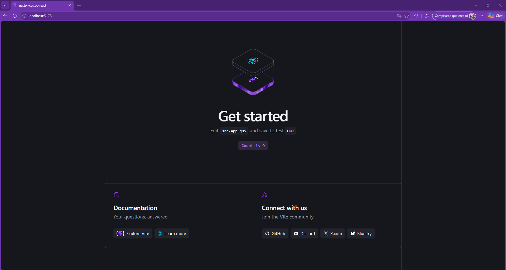

### 2. Repositorio GitHub inicial

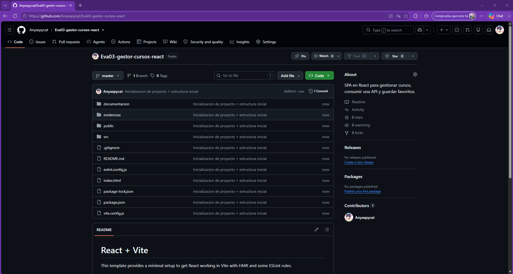

### 3. Aplicación funcionando

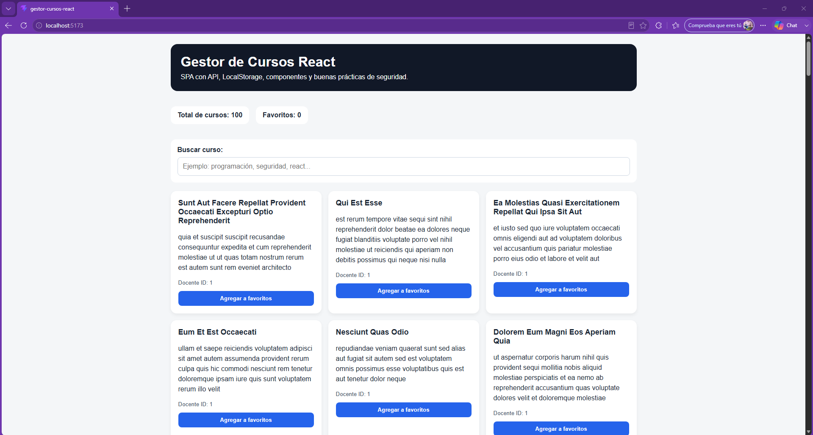

### 4. Búsqueda y favoritos

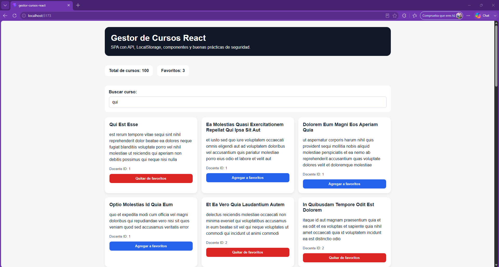

### 5. Favoritos almacenados en LocalStorage

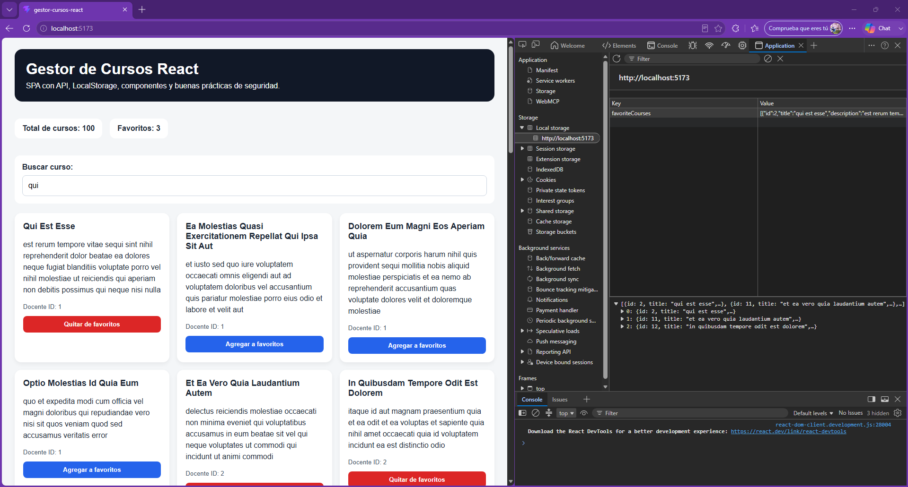

### 6. Validación con ESLint

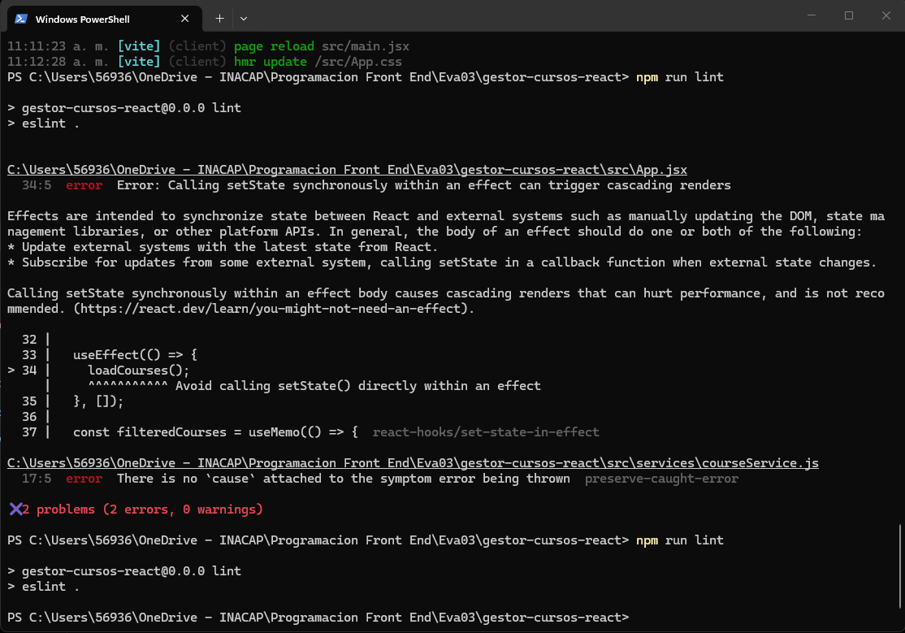

### 7. Filtro por docente

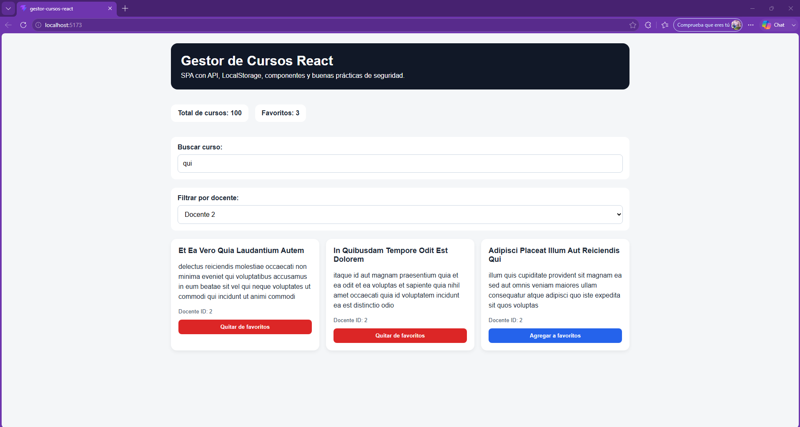

### 8. Favoritos por docente

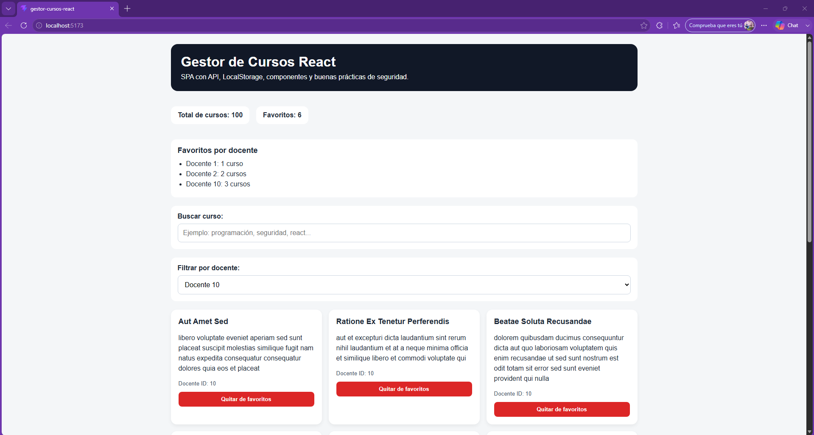

### 9. Modo oscuro persistente

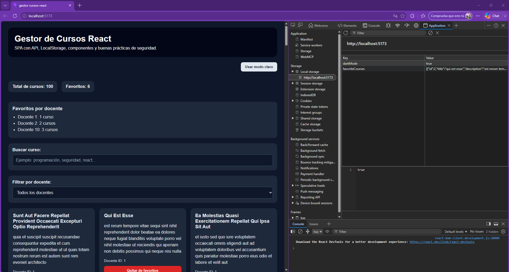

### 10. Consumo alternativo mediante Fetch

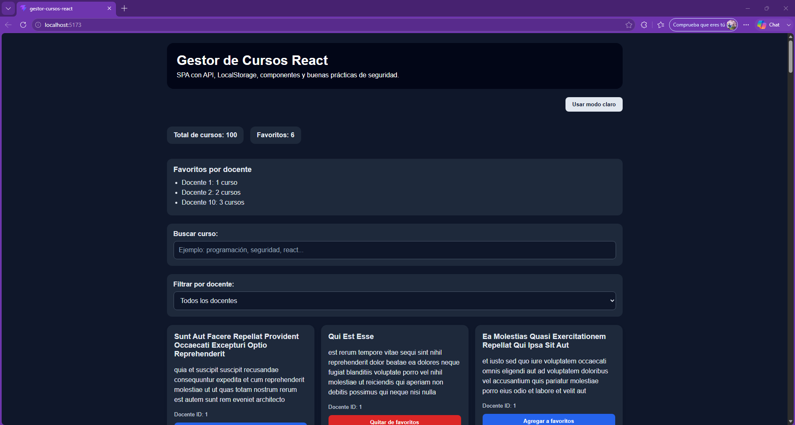

### 11. Compilación exitosa

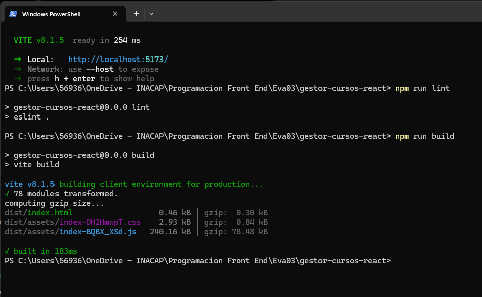

### 12. SonarQube iniciado

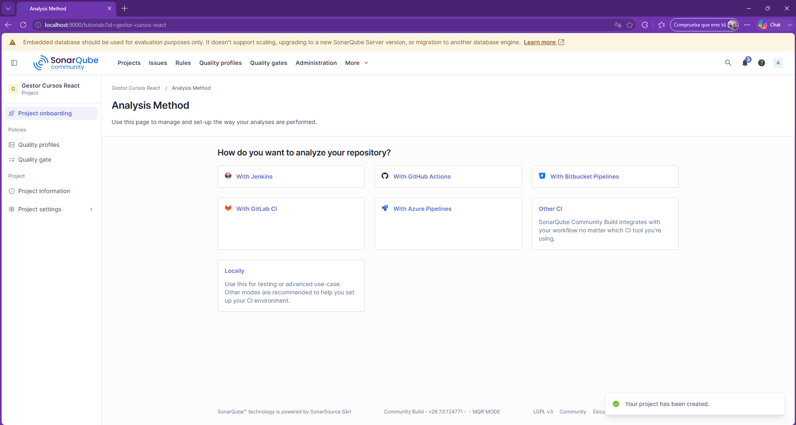

### 13. Resultado inicial de SonarQube

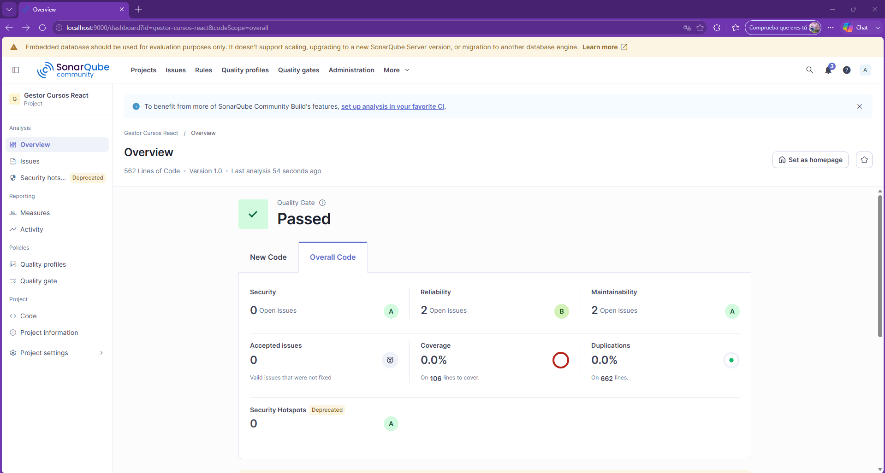

### 14. Issues detectados

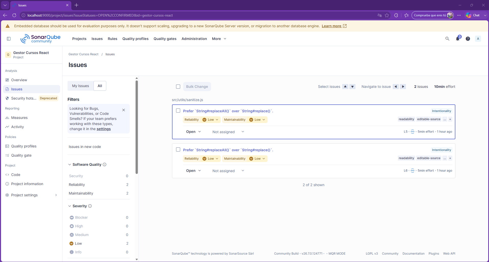

### 15. Resultado final sin issues

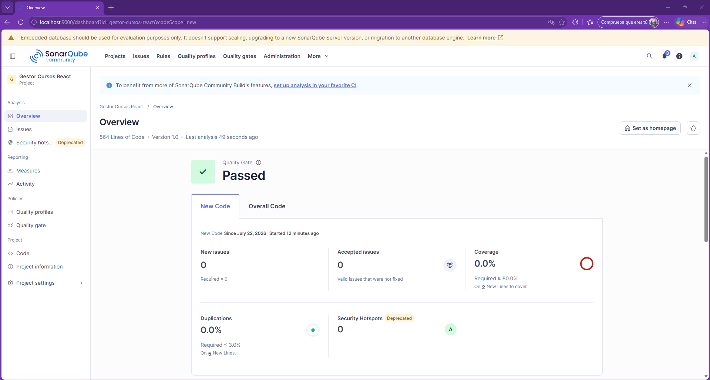
